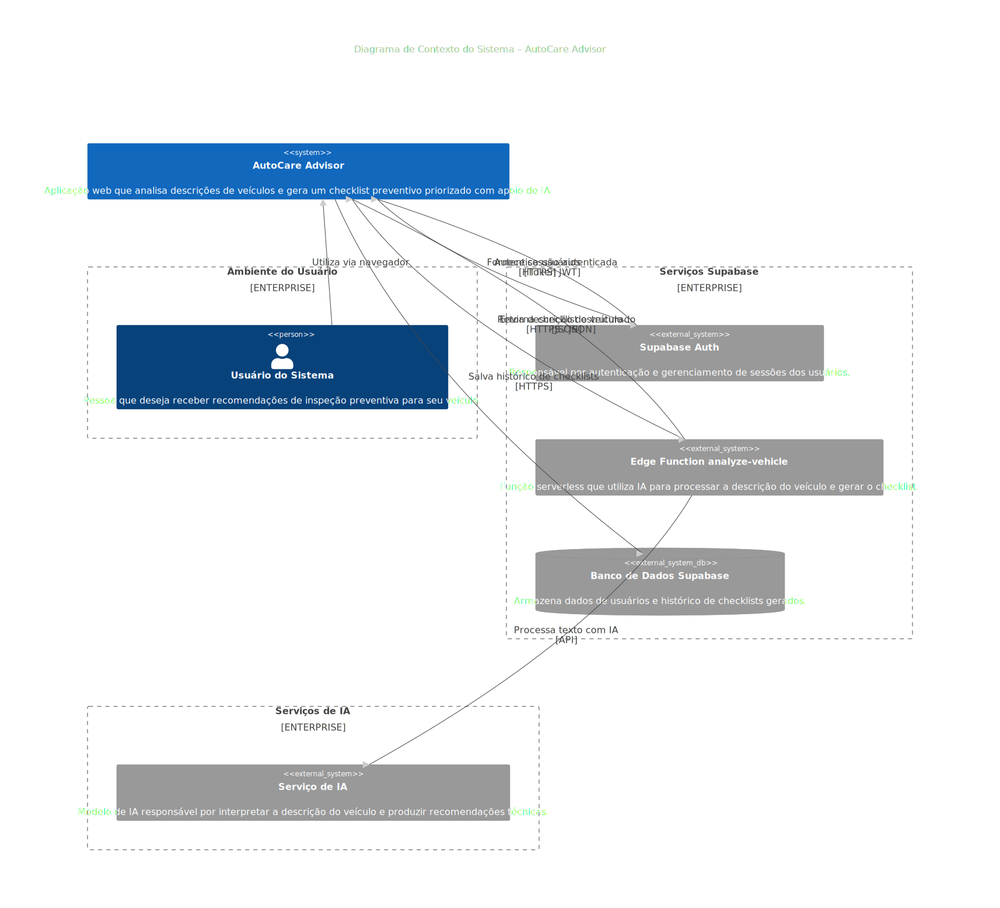
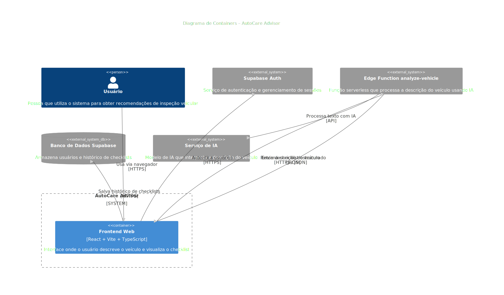

# 🚗 AutoCare Advisor

O **AutoCare Advisor** é uma aplicação web que gera um **checklist personalizado de inspeção preventiva veicular** com base na descrição livre de um carro e seu tipo de uso.

O usuário descreve o veículo em linguagem natural (modelo, ano, tipo de uso, quilometragem etc.), e o sistema analisa as informações usando um backend com IA para produzir um **checklist técnico priorizado**, incluindo justificativas e fontes.

---

## ✨ Funcionalidades

* 🔍 **Análise do Veículo em Linguagem Natural**  
  O usuário pode descrever o veículo livremente — sem formulários rígidos.

* 📋 **Checklist Preventivo Priorizado**  
  Os itens são organizados por nível de importância:

  * **Crítico**
  * **Importante**
  * **Recomendado**

* 🧠 **Justificativas Técnicas**  
  Cada item do checklist inclui uma explicação do *porquê* ele é importante para aquele perfil específico de veículo.

* 📚 **Fontes Técnicas**  
  O sistema pode fornecer referências que sustentam as recomendações de manutenção.

* 👤 **Autenticação de Usuário**  
  Usuários podem se cadastrar e fazer login via Supabase Auth.

* ☁️ **Processamento com IA Serverless**  
  A análise do veículo é realizada por uma Edge Function do Supabase.

---

## 🧱 Tecnologias Utilizadas

**Frontend**

* React 18 + TypeScript
* Vite
* Tailwind CSS
* shadcn/ui + Radix UI
* React Hook Form + Zod
* TanStack React Query
* React Router DOM

**Backend / Serviços**

* Supabase (Autenticação e Edge Functions)
* Edge Function `analyze-vehicle` (análise veicular com IA)
* Google Gemini (via Lovable AI Gateway)
* Serper API (busca de fontes técnicas)
* Deno (runtime para Edge Functions)

**Testes**

* Vitest
* Testing Library

---

## 📂 Estrutura do Projeto

```
src/
│
├── components/          # Componentes de interface (formulários, resultados, layout)
├── pages/               # Páginas de rota (Index, Login, Signup)
├── integrations/
│   └── supabase/        # Cliente Supabase e tipos gerados
├── lib/
│   └── vehicleParser.ts # Tipos e lógica de normalização dos dados do veículo
├── hooks/               # Hooks customizados do React
└── main.tsx             # Ponto de entrada da aplicação
```

---

## 🧠 Como Funciona

1. **Entrada do Usuário**: O usuário insere uma descrição do veículo em linguagem natural (exemplo:
   *"Corolla 2014, uso principalmente urbano, 120.000 km"*).

2. **Chamada da Edge Function**: O frontend envia esse texto para a Edge Function do Supabase:

   ```ts
   supabase.functions.invoke('analyze-vehicle', {
     body: { description }
   })
   ```

3. **Processamento no Backend**:

   a) **Busca de Fontes Técnicas** (se `SERPER_API_KEY` configurada):
   - Consulta Serper API com queries como "manutenção preventiva + modelo do veículo"
   - Retorna artigos técnicos, manuais e checklists confiáveis
   
   b) **Análise com IA** (Google Gemini via Lovable):
   - Processa a descrição do veículo
   - Combina com as fontes técnicas encontradas
   - Gera checklist priorizado (Crítico → Importante → Recomendado)
   - Cria justificativas técnicas para cada item

4. **Resposta Estruturada**: A Edge Function retorna:

   ```ts
   interface ChecklistResult {
     vehicleInfo: VehicleInfo;          // Modelo, ano, uso, km
     criticos: ChecklistItem[];         // Itens críticos (segurança)
     importantes: ChecklistItem[];      // Itens importantes
     recomendados: ChecklistItem[];     // Itens recomendados
     fontes?: TechnicalSource[];        // Referências técnicas
   }
   ```

5. **Apresentação no Frontend**:

   * Normaliza as informações do veículo (`normalizeVehicleInfo`)
   * Exibe o checklist categorizado por prioridade
   * Mostra justificativas técnicas para cada item
   * Apresenta links para as fontes técnicas consultadas
   * Permite marcação de itens concluídos

---

## 🔧 Variáveis de Ambiente

### Frontend (`.env` na raiz do projeto)

```env
VITE_SUPABASE_URL=seu_supabase_project_url
VITE_SUPABASE_PUBLISHABLE_KEY=sua_supabase_anon_key
```

**Necessárias para:**

* Autenticação de usuários
* Chamada da Edge Function `analyze-vehicle`

### Backend (Supabase Edge Function)

Configure as seguintes variáveis de ambiente no Supabase:

```env
LOVABLE_API_KEY=sua_lovable_api_key
SERPER_API_KEY=sua_serper_api_key
```

**O que cada uma faz:**

* **LOVABLE_API_KEY**: Integração com Google Gemini via Lovable AI Gateway para análise de IA do veículo
* **SERPER_API_KEY**: Integração com Serper para buscar fontes técnicas confiáveis (manuais, artigos, checklist)


---

## 🏗️ Arquitetura do Sistema

Abaixo estão os diagramas de arquitetura do **AutoCare Advisor**, seguindo o modelo C4.

### 🌍 Diagrama de Contexto

Mostra como o sistema se relaciona com usuários e serviços externos.



---

### 🧱 Diagrama de Containers

Apresenta os principais blocos técnicos da aplicação e como eles se comunicam.



---

## ▶️ Executando Localmente

Instale as dependências:

```bash
npm install
```

Inicie o servidor de desenvolvimento:

```bash
npm run dev
```

A aplicação estará disponível em:

```
http://localhost:8080
```

---

## 🏗️ Build para Produção

```bash
npm run build
npm run preview
```

---

## 🧪 Executando os Testes

```bash
npm run test
```

Modo de observação:

```bash
npm run test:watch
```

---

## 🔌 Edge Function do Supabase

### Função Principal: `analyze-vehicle`

Responsável pela análise inteligente do veículo e geração do checklist.

**Entrada**:
```ts
{ description: string }
```

**Saída**:

```ts
interface ChecklistResult {
  vehicleInfo: VehicleInfo;          // Dados normalizados do veículo
  criticos: ChecklistItem[];         // Itens de segurança crítica
  importantes: ChecklistItem[];      // Manutenção importante
  recomendados: ChecklistItem[];     // Itens recomendados
  fontes?: TechnicalSource[];        // Fontes técnicas (quando Serper ativo)
}
```

### Fluxo Interno:

1. **Validação**: Verifica se descrição foi fornecida
2. **Busca Serper** (opcional): Se `SERPER_API_KEY` configurada:
   - Pesquisa por "[descrição do veículo] manutenção preventiva inspeção checklist técnico"
   - Configura para resultados em português (gl=br, hl=pt-br)
   - Retorna até 5 resultados com título, URL e snippet
3. **Análise com Gemini**: Processa descrição + fontes técnicas
4. **Parsing**: Converte resposta JSON para o formato estruturado
5. **Resposta**: Retorna checklist priorizado com fontes

### Dependências:

* `LOVABLE_API_KEY`: Acesso ao Google Gemini
* `SERPER_API_KEY`: Opcional - para buscar fontes técnicas (recomendado)

**Nota**: Se `SERPER_API_KEY` não estiver configurada, a função continua funcionando mas sem fontes técnicas externas.

---

## 🚀 Melhorias Futuras

* Salvar histórico de checklists por usuário
* Lembretes de manutenção baseados em tempo/quilometragem
* Suporte a motocicletas e veículos pesados

---

## 👨‍💻 Autores

Projeto desenvolvido por:

- João Victor Nogueira de Souza  
- Marinel Borges Almeida

---

## 📄 Licença

Este projeto é para fins educacionais e de demonstração.

---
